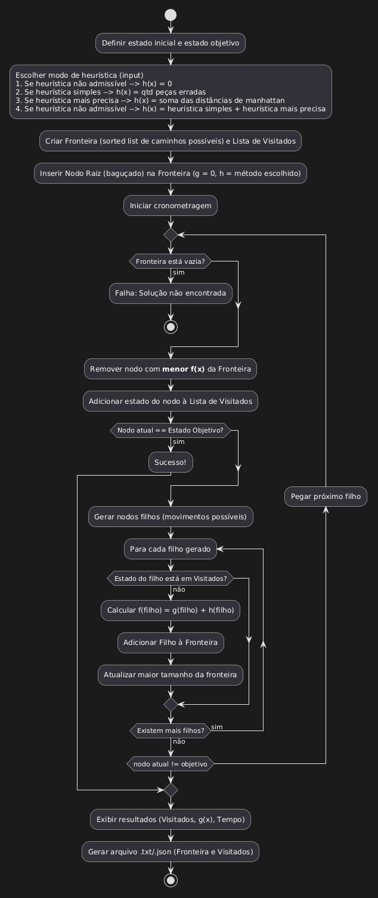

> Departamento de Informática e Estatística Curso de Sistemas de
> Informação Disciplina de Sistemas Inteligentes Profa. Nathalia da Cruz
> Alves
>
> **Trabalho Prático 1 - Métodos de Busca**

O propósito do trabalho é implementar1 o algoritmo de busca **A\***. A
implementação será testada através do jogo 8-puzzle2, o qual também
fornece o contexto para a heurística.

A entrada do programa é um tabuleiro desordenado (com o quadrado sem
número **em qualquer lugar** do tabuleiro) e um algoritmo de
busca. A saída principal do programa **é o menor caminho**
(**a sequência de movimentos** do quadrado sem número) para
chegar ao tabuleiro ordenado3. Além do caminho, ao final, deve ser
exibido:

> a\) O total de nodos visitados 
>
> b\) O tamanho do caminho
>
> c\) Tempo de execução (em segundos)
>
> d\) O maior tamanho da fronteira (lista de abertos)
>
> e\) Um arquivo .txt ou .json contendo a fronteira e os visitados no
> momento do término da execução

Para a implementação do algoritmo, a equipe deve implementar 4 variações
do algoritmo:

> 1\. Custo Uniforme (sem heurística)
>
> 2\. A\* com uma heurística não admissível
>
> 3\. A\* com uma heurística admissível simples
>
> 4\. A\* com a heurística admissível mais precisa que conseguirem

**Juntament com a implementação (.ZIP) deverá ser entregue um vídeo (link disponibilizado no Youtube ou Google Drive) de até 10 minutos explicando brevemente:**

> 1\. Quais os métodos ou funções principais e **suas relações** com
> o algoritmo A\*;
>
> 2\. **Como foi gerenciada  fronteira, ou seja, quais verificações foram feitas antes de adicionar um estado na fronteira** (explicar
> e mostrar os respectivos trechos de código)**;**
>
> 3\. **Descrição das heurísticas e comparação da faixa de valores e da precisão delas (no mínimo: dois casos difíceis, dois médios e um
> fácil**); breve descrição sobre suas implementações;**

> 4\. **Breve análise do desempenho da implementação com uma tabela comparativa**
> (<u>usando as informações da saída - itens **a)** até **d)**</u>) das 4
> variações implementadas (no mínimo: um caso difícil, um médio e um
> fácil para as abordagens 3 e 4 e um médio e um fácil para as
> abordagens 1 e 2);
>
> 5\. Caso algum dos objetivos não tenha sido alcançado explique o que
> você faria VS o que foi feito e exatamente qual o(s) problema(s)
> encontrado(s), bem como limitações da implementação.

Caso tenha sido utilizado algum referencial teórico ou prático, o mesmo
deverá ser informado (incluindo-se repositórios, e quaisquer
códigos-fonte). Recomendo que utilizem ferramentas de IA generativas
apenas para auxiliar na pesquisa, nesse caso, também citem qual
ferramenta foi utilizada e para qual finalidade. A **avaliação da implementação** considera especialmente a forma de implementar a busca
e os cálculos das heurísticas. Para receber nota máxima na implementação
é necessário utilizar uma estrutura de dados e de busca adequada além de
implementar a heurística matematicamente (sem uso de regras
codificadas). **Importante**: a avaliação considera todo o trabalho
realizado, não apenas uma saída correta. No livro do Russel & Norvig e
no do Luger são apresentadas boas discussões sobre heurísticas para esse
problema e também uma boa apresentação do A\*.

Se for detectado plágio de qualquer forma, **todos** os envolvidos
receberão nota 0 e não será possível entregar o trabalho novamente em
nenhum momento.

**O trabalho foi planejado para ser desenvolvido por grupos de até 2 alunos.**

**Prazo para entrega: 30/04/2026 → 03/05/2026**

1\. Linguagens: preferencialmente Python e opcionalmente Java ou JS. Em
qualquer uma das linguagens NÃO utilize bibliotecas 3D e evite
bibliotecas de uma maneira geral. A interface com o usuário NÃO será
avaliada. Se quiser utilizar outra linguagem converse com a professora
primeiro.

2\. Quem desejar implementar o algoritmo A\* (ou o MINMAX) com outro
problema ou jogo, converse com a professora para ver a viabilidade do
projeto.

3\. Para a implementação deste trabalho deve ser considerada <u>apenas
uma solução</u> <u>possível:</u>

|   |   |   |
|---|---|---|
| 1 | 2 | 3 |
| 4 | 5 | 6 |
| 7 | 8 | _ |

Caso alguém queira implementar com **qualquer** solução também pode, mas
nesse caso deve-se considerar **todas** as possíveis soluções, e não
somente uma.

---

